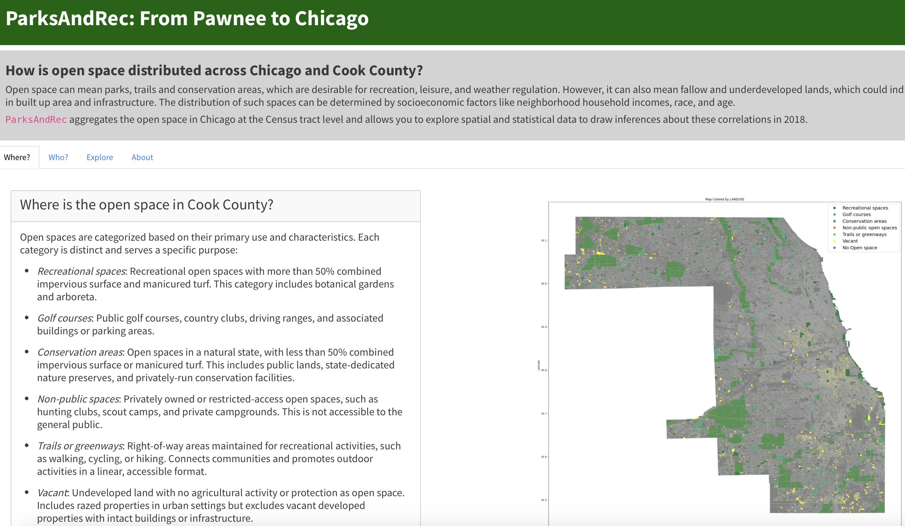

# parksAndRec: Understanding the Spatial and Demographic Distribution of Open Space in Chicago

This project asks two questions: How is open space spatially distributed across Cook County? Who has access to these open spaces? 

We use 2018 land use data from the [Chicago Metropolitan Agency for Planning](https://datahub.cmap.illinois.gov/datasets/CMAPGIS::2018-land-use-inventory-for-northeastern-illinois/about), which classifies open spaces into five subcategories: Recreational, Golf Courses, Conservation, Non-Public, and Trails/Greenways. We also spatialize Vacant Land from the same dataset to argue that not all open space can be understood in the same way.

To understand who has access to open space (that falls within the five subcategories), we assign each land parcel from the spatial dataset to a census tract, and produce socio-demographic statistics at tract level. We downloaded census tract spatial data  from the pygris package and accessed statistical data on the tracts from the [American Community Survey API](https://www.census.gov/programs-surveys/acs/data/data-via-api.html). These include attributes such as median household income, race, and property values. In addition to this visual, we provide the user with an interactive tool that allows them to filter Cook County by specific land use area and understand how that impacts income distributions across Census tracts.

### Running the project
First, make sure you have an [API key](https://www.census.gov/data/developers/guidance/api-user-guide.Help_&_Contact_Us.html) from the Census. Once you have the key, type `CENSUS_KEY=”<your key>”` into the terminal, creating an OS variable that the parksandrec will use. To test whether it has been set correctly, type `echo $CENSUS_KEY` and you should see it display.

Next, clone the project or download it from [Github](https://github.com/uchicago-2025-capp30122/30122-project-parksandrec).

Next, run `uv sync` to install all the dependencies for the project.

In the parent folder of parksandrec, run the command `uv run python download.py`.

You will see a progress bar that downloads a Pandas pickle data file (approx 280MB) from the cloud, which is the dataset that the project runs on. This is stored in a new folder parksandrec/data.

Once the download has completed, run the command `uv run python parksandrec`

You will see the URL for the local server the app is running on:
`Dash is running on <localhost address>`

Enter that URL into your browser to interact with the project! Instructions on how to use each tab are provided on the dashboard.

To test the project, run `uv run pytest tests` inside the parksandrec folder.

### Data Sources
parksAndRec uses land parcel level data from the [Chicago Metropolitan Agency for Planning](https://datahub.cmap.illinois.gov/datasets/CMAPGIS::2018-land-use-inventory-for-northeastern-illinois/about), which can be downloaded as a GeoJSON, Shapefile, and several other formats. The geospatial data for the Census tracts in Cook County came from the Census’s [TIGER files](https://www2.census.gov/geo/tiger/GENZ2018/shp/), which are also available to download. The sociodemographic data came from the American Community Survey [API](https://www.census.gov/programs-surveys/acs/data/data-via-api.html).

## Team parksAndRec
- José María (Chema) Gálvez Enríquez <jmgalvez@uchicago.edu>
- Pablo Hernandez Pedraza <phernandezpedraz@uchicago.edu>
- Raghav Mehrotra <raghavm@uchicago.edu>
- Sarah Hussain <sthussain@uchicago.edu>

